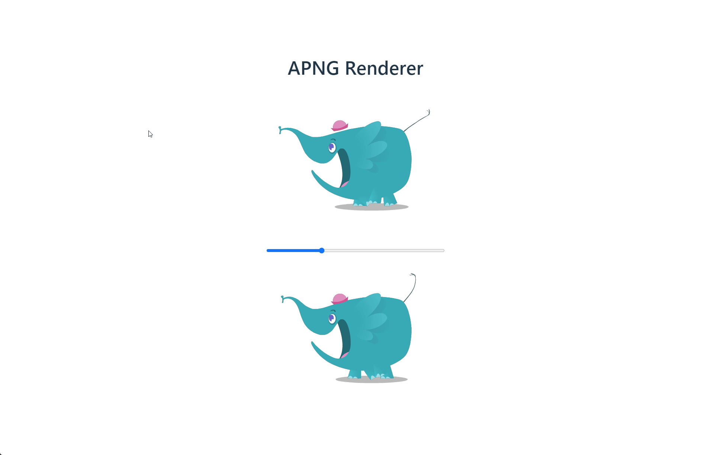

# APNG Renderer

JavaScript Library for rendering apng image files.



## Getting Started

```js
const arrayBuffer = new Uint8Array(/* APNG file */);

// Load the apng file.
const renderer = new Renderer(arrayBuffer);
await renderer.loadAsync();

// Create a canvas for rendering.
const canvas = renderer.createCanvasElement();
document.body.appendChild(canvas);

// Render
let index = 0;
const render = () => {
    renderer.renderFrame(index, canvas);
    index++;

    if(index > renderer.frameCount - 1) {
        index = 0;
    }

    requestAnimationFrame(render);
}
render();
```